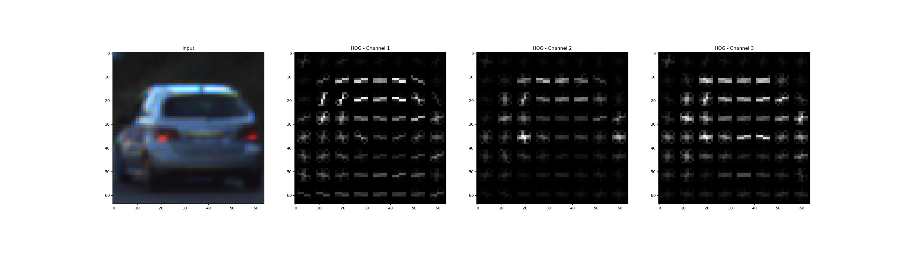
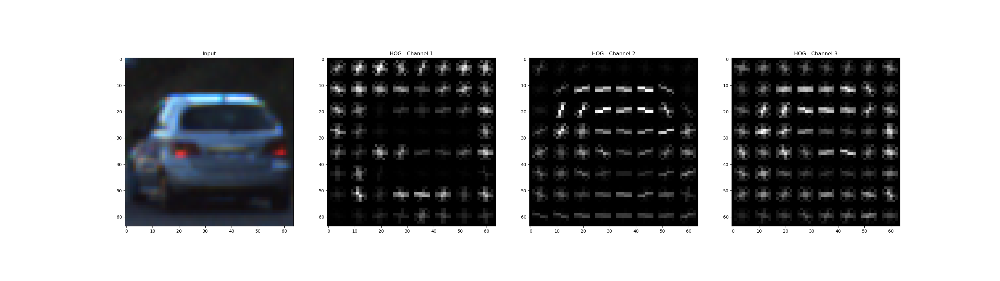
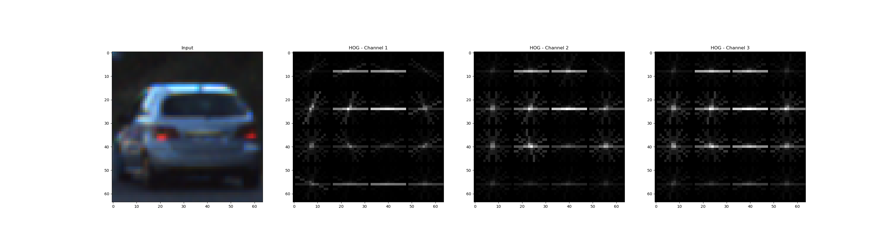
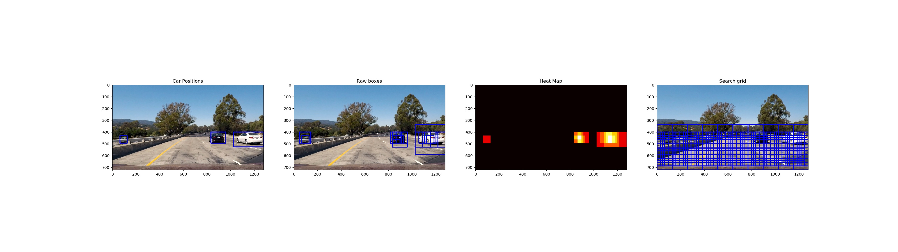
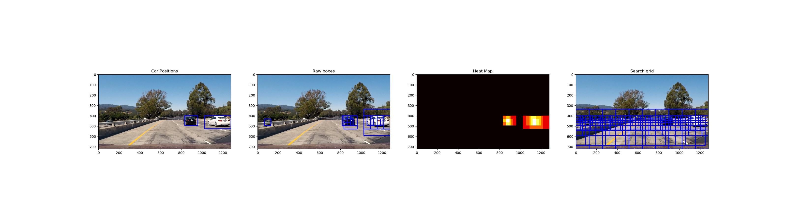
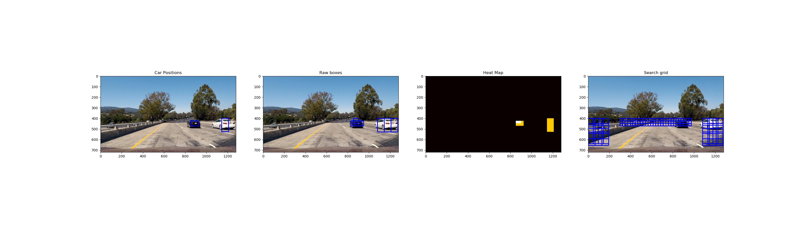
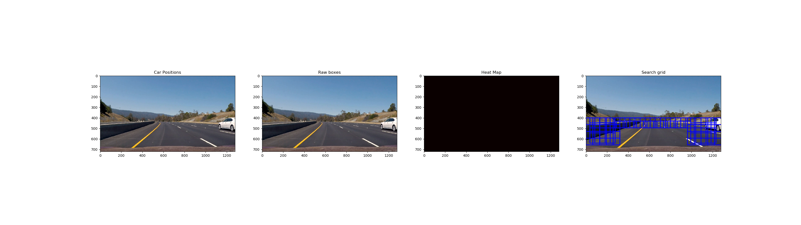

## Vehicle Detection Project

Project 5 in term 1 of the Udacity self-driving car nano-degree

---

The goals / steps of this project are the following:

* Perform a Histogram of Oriented Gradients (HOG) feature extraction on a labeled training set of images and train a classifier Linear SVM classifier
* Optionally, you can also apply a color transform and append binned color features, as well as histograms of color, to your HOG feature vector. 
* Note: for those first two steps don't forget to normalize your features and randomize a selection for training and testing.
* Implement a sliding-window technique and use your trained classifier to search for vehicles in images.
* Run your pipeline on a video stream (start with the test_video.mp4 and later implement on full project_video.mp4) and create a heat map of recurring detections frame by frame to reject outliers and follow detected vehicles.
* Estimate a bounding box for vehicles detected.

### Histogram of Oriented Gradients (HOG)

#### 1. Extracting HOG features from the training images.

The code for this step is contained in [lines 51-66 of features_extraction.py](https://github.com/ivovandongen/CarND-Vehicle-Detection/blob/master/feature_extraction.py#L51-L66)

I started by reading in all the `vehicle` and `non-vehicle` images.  Here is an example of one of each of the `vehicle` and `non-vehicle` classes:

I then explored different color spaces and different `skimage.hog()` parameters (`orientations`, `pixels_per_cell`, and `cells_per_block`).  I grabbed random images from each of the two classes and displayed them to get a feel for what the `skimage.hog()` output looks like.

Here is an example using the `YCrCb` color space and HOG parameters of `orientations=8`, `pixels_per_cell=(8, 8)` and `cells_per_block=(2, 2)`:

In contrast, here is the same parameters, but in `HLS` color space

#### 2. Final choice of HOG parameters.

I tried various combinations of parameters and mostly tried to strike a balance
between accuracy and performance. Using a large set of features would slow down processing
a lot, so a minimum was chosen that still performed well. Additionally,
a large feature set also would lead to memory issues. This was partially solved by using
a partial fit on the scaler. 

The final HOG parameters I settled on were:
- color space: 'YCrCb'
- orient: 9
- pixels per cell: 16 
- cells per block: 4 
- hog channels: all

Which would result in:

#### 3. Training the classifier using selected HOG and color features

I trained a linear SVM using GridSearchCV to explore which combination of parameters would give me the
best fit in [Classifier_fit()](https://github.com/ivovandongen/CarND-Vehicle-Detection/blob/master/classifier.py#L25-L48)

I explored both linear and rbf kernels and ended up using rbf even though it is much slower than a linear svm. The linear svm
gave too many false positives to work with and I preferred optimising in other areas. Especially since HOG feature extraction
weighed much heavier on the overall processing time.

The dataset was processed to extract HOG features, color histograms and spatial binning before leveling the features and training
the SVM's on it. To verify the svm, the test set was split in a training and test set.

### Sliding Window Search

For the sliding window I initially used overlapping windows with different scales over the entire lower half of the image 
(the relevant part where we would expect cars). The boxes ranged from the smallest a car would be on the horizon to the largest
a car would appear directly next or in front of the camera. This is an accurate, but impossibly slow way to search the images.

I then went on to defined multiple regions with different scales. Only using the smallest scales near the horizon and working
down in increasingly large windows. This certainly sped up the detection. But not quite enough still.

For the video processing I eventually settled on a search grid that just covered the outer edges of the frame, where you would
expect cars to enter the view. The video processing would then track cars over frames by adding search grids for positive detections
(read more further down). This gave a more reasonable performance.

To further optimize the window search, I tweaked the spatial size of the binned colors and the size
of the histograms. Also iterating on the HOG detection a lot since the initial choices were mostly 
focused on accurate representation, which was much too slow in this stage.

Ultimately I searched on 3 scales using YCrCb 3-channel HOG features plus spatially binned color and histograms of color in the feature vector, which provided a nice result.

A final optimization, which was very impactful, was to only process one in every 4 frames in the video and
re-use the detections in the other. With 25 FPS, this is hardly noticeable in the end-result, but did speed up
processing so that it can realistically be used in real time.

### Video Implementation

#### 1.Final video output.
Here's a [link to my video result](output_videos/processed_project_video.mp4)

#### 2. Identification of false positives and handling of overlapping boxes

To deal with false positives and overlapping bounding boxes a history of heatmaps per frame is kept and used as a rolling
average. With the build-up of history, the threshold on the heatmap is also increased, making sure that random glitches don't
show up in the end-result. False positives are filtered out this way as they usually don't show up multiple frames in a row. 
The code for the heatmap history processing can be found in [lines 113-123 of video_processor.py](https://github.com/ivovandongen/CarND-Vehicle-Detection/blob/master/video_processor.py#L113-L123)

For ever x'th frame (depending on the frame division setting):
- A search grid is built, using the main search grid plus a grid per previous detection
- The grid is searched for matches
- The resulting matches are turned into a heatmap (this is later stored in the history)
- The heatmap is combined with the previous heatmaps, increasing the threshold for every heatmap in the history
- The resulting heatmap is thresholded with the incremented threshold value
- Labels are then generated from this heatmap using `scipy.ndimage.measurements.label()`
- The resulting labels are plotted on the original image

For every other frame (where we don't run detection) the previous labels are just plotted. This is visually not detectable
as a slight lag of the box behind the car sometimes, but greatly increases the speed of processing.

Here's an example result showing the heatmap from a series of frames of video. In these frames you initially only
see the main search grid. Then as a vehicle is detected, an additional grid is added to ensure solid tracking. Once
enough frames show overlapping detections, the vehicle is determined to be a true positive and is included
in the output.

---

### Discussion

The resulting pipeline works well on the project video. However, in realistic scenarios it will fail on a number of conditions:
- Different lighting / weather conditions. Manual feature extraction is proved fragile still to changing conditions
- Reset during operation. As I use a detection window on the edges, any car that does not enter through these edges will not be 
detected. If for some reason the detection would only start in mid traffic, an initialization phase would need to be used where a
full grid is searched.
- The resulting pipeline operates well at around 8-10 FPS on a decent laptop. This is however way to intensive for any kind of mobile
/ embedded situation. To use these techniques in these scenarios, hardware acceleration would be a must.

